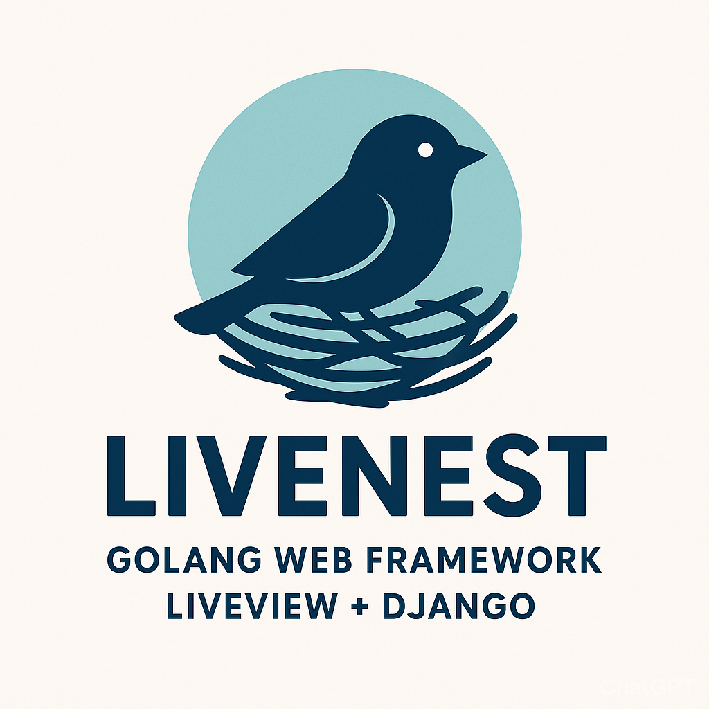

<p align="center">
  
</p>

<h1 align="center">LiveNest 🪺</h1>
<p align="center">
  <b>Django-like Web Framework for Go</b><br/>
  <i>with Phoenix LiveView-inspired real-time capabilities</i>
</p>

<p align="center">
  <a href="https://github.com/paulmanoni/livenest/actions">
    
  </a>
  <a href="https://pkg.go.dev/github.com/paulmanoni/livenest">
    
  </a>
  <a href="https://goreportcard.com/report/github.com/paulmanoni/livenest">
    
  </a>
  <a href="LICENSE">
    
  </a>
</p>

A Django-like web framework for Go with Phoenix LiveView-inspired real-time capabilities.

Build real-time, interactive web applications with the simplicity of server-side rendering and the power of WebSockets.

## Features

### Core Framework
- **Gin-based Routing**: Fast HTTP routing powered by Gin with fluent API
- **GORM ORM**: Database access with GORM, supporting SQLite, PostgreSQL, and MySQL
- **Django-like QuerySets**: Familiar API for database queries
- **Configuration**: Support for JSON and TOML configuration files
- **Template Engine**: HTML template rendering with custom functions and file-based templates

### LiveView (Phoenix-inspired)
- **Real-time Components**: Interactive components using WebSockets
- **Phoenix LiveView-style Diffing**: Efficient DOM updates using JSON diffs instead of full HTML
- **Input Protection**: Prevents cursor jumping and race conditions while typing
- **Event Routing**: Automatic routing of events to `Handle*` methods using reflection
- **Event Attributes**: `lv-click`, `lv-change`, `lv-submit` for declarative event handling
- **Debounced Updates**: Configurable debouncing with `lv-debounce` attribute
- **Flash Messages**: Built-in notification system (success, error, info, warning)
- **Component System**: Reusable components with `<lv-component>` web component tag
- **Template Components**: File-based templates with `TemplateComponent` base class

### Form Handling
- **Auto-generated Forms**: Create forms automatically from Go structs using tags
- **Type-safe Validation**: Struct tag-based validation (`required`, `email`, `min`, `max`, etc.)
- **Real-time Validation**: Live validation feedback as users type
- **Custom Validators**: Define custom validation logic with closures
- **Multiple Field Types**: Support for text, email, password, number, checkbox, select, and more

## Project Structure

```
livenest/
├── core/           # Core application and context
├── orm/            # ORM manager and querysets
├── liveview/       # LiveView components and WebSocket handling
├── template/       # Template engine and functions
├── admin/          # Admin interface (coming soon)
└── examples/       # Example applications
```

## Quick Start

### Installation

```bash
go get livenest
```

### Basic Usage

```go
package main

import (
    "livenest/core"
    "gorm.io/driver/sqlite"
)

func main() {
    // Create app
    app := core.New(nil)

    // Connect database
    app.ConnectDB(sqlite.Open("app.db"))

    // Define routes
    app.GET("/", func(c *gin.Context) {
        c.JSON(200, gin.H{"message": "Hello LiveNest!"})
    })

    // Run server
    app.Run(":8080")
}
```

## LiveView Example

Create an interactive counter component with automatic event routing:

```go
package main

import (
    "fmt"
    "html/template"
    "livenest/core"
    "livenest/liveview"
    "gorm.io/driver/sqlite"
)

// CounterComponent is a simple counter LiveView component
type CounterComponent struct {
    liveview.TemplateComponent
}

// Mount initializes the counter component
func (c *CounterComponent) Mount(socket *liveview.Socket) error {
    socket.Assign(map[string]interface{}{
        "count": 0,
    })
    return nil
}

// Events are automatically routed to Handle* methods
func (c *CounterComponent) HandleIncrement(socket *liveview.Socket, payload map[string]interface{}) error {
    count := socket.Assigns["count"].(int)
    socket.Assign(map[string]interface{}{
        "count": count + 1,
    })
    return nil
}

func (c *CounterComponent) HandleDecrement(socket *liveview.Socket, payload map[string]interface{}) error {
    count := socket.Assigns["count"].(int)
    socket.Assign(map[string]interface{}{
        "count": count - 1,
    })
    return nil
}

func (c *CounterComponent) HandleReset(socket *liveview.Socket, payload map[string]interface{}) error {
    socket.Assign(map[string]interface{}{
        "count": 0,
    })
    return nil
}

// Render returns the HTML for the counter component
func (c *CounterComponent) Render(socket *liveview.Socket) (template.HTML, error) {
    count, _ := socket.Get("count")
    html := fmt.Sprintf(`
        <div class="counter">
            <h1>LiveView Counter</h1>
            <div class="count-display">
                <h2>Count: %d</h2>
            </div>
            <div class="buttons">
                <button lv-click="decrement">-</button>
                <button lv-click="reset">Reset</button>
                <button lv-click="increment">+</button>
            </div>
        </div>
    `, count)
    return template.HTML(html), nil
}

func main() {
    // Create app
    app := core.New(nil)

    // Connect to database
    app.ConnectDB(sqlite.Open("example.db"))

    // Register LiveView route
    app.NewHandler().
        Path("/").
        AsLive().
        AddComponent(&CounterComponent{}).
        Build()

    // Start server
    app.Run(":8080")
}
```

The counter updates in real-time using WebSockets. The server sends only the minimal diff (e.g., just the count value changed), and the client efficiently patches the DOM without full page reloads.

### Using Template Files

Components can also render from HTML template files:

```go
type TodoListComponent struct {
    liveview.TemplateComponent
}

func (t *TodoListComponent) Mount(socket *liveview.Socket) error {
    t.TemplateDir = "examples/templates"
    socket.Assign(map[string]interface{}{
        "todos": []TodoItem{},
    })
    return nil
}

func (t *TodoListComponent) Render(socket *liveview.Socket) (template.HTML, error) {
    return t.TemplateComponent.Render("todo.html", socket.Assigns)
}
```

## Running Examples

```bash
cd examples
go run main.go
```

The example server includes multiple LiveView demonstrations:

- **http://localhost:8080** - Counter (inline template)
- **http://localhost:8080/counter** - Counter (fluent API)
- **http://localhost:8080/counter-template** - Counter (file template)
- **http://localhost:8080/dashboard** - Dashboard (subdirectory template)
- **http://localhost:8080/todo** - Todo List (CRUD operations)
- **http://localhost:8080/form** - Contact Form (manual validation)
- **http://localhost:8080/chat** - Real-time Chat
- **http://localhost:8080/registration** - User Registration (auto-generated form)
- **http://localhost:8080/contact** - Contact Form (auto-generated)
- **http://localhost:8080/review** - Product Review (auto-generated)
- **http://localhost:8080/login** - Login Form (auto-generated)
- **http://localhost:8080/component-tag** - `<lv-component>` web component examples

## Core Components

### App

The main application wrapper that combines Gin and GORM:

```go
app := core.New(&core.Config{
    Debug: true,
    TemplateDir: "templates",
    StaticDir: "static",
})
```

### ORM Manager

Django-like queryset API:

```go
qs := orm.NewQuerySet(db)
users, err := qs.Filter("age > ?", 18).OrderBy("name").All(&users)
```

### LiveView

Real-time components with WebSocket communication:

- `Component` interface for defining interactive components
- `Socket` for managing state and assigns
- **Phoenix LiveView-style diffing**: Server computes minimal JSON diffs, client applies patches efficiently
- **Input typing protection**: Preserves user input and cursor position during server updates (prevents the "typing problem")
- **Morphdom-style DOM patching**: Only updates changed elements while preserving form state
- Flash messages for user notifications (`socket.PutFlash("success", "Message")`)
- Event attributes: `lv-click`, `lv-change`, `lv-submit`
- Debounced events: Use `lv-debounce="300"` to control update frequency
- Automatic event routing to `Handle*` methods

### Auto-generated Forms

Create type-safe forms with validation using struct tags:

```go
type UserRegistration struct {
    Name     string `form:"label:Full Name" validate:"required"`
    Email    string `form:"type:email,label:Email Address" validate:"required,email"`
    Password string `form:"type:password,label:Password" validate:"required,min:8"`
    Age      int    `form:"type:number,label:Age" validate:"required,min:18,max:100"`
    Terms    bool   `form:"type:checkbox,label:I agree to terms" validate:"required"`
}

// Create form component
form := liveview.NewForm(UserRegistration{}, func(data UserRegistration, socket *liveview.Socket) error {
    // Handle successful submission
    socket.PutFlash("success", "Registration successful!")
    return nil
})
```

Supported validation rules:
- `required` - Field must not be empty
- `email` - Valid email format
- `min:N` - Minimum value/length
- `max:N` - Maximum value/length
- Custom validators with closures

### Template Engine

```go
engine := template.NewEngine("templates")
engine.Load()
html, err := engine.Render("index.html", data)
```

## Configuration

Create a `config.json`:

```json
{
  "debug": true,
  "template_dir": "templates",
  "static_dir": "static",
  "database": {
    "driver": "sqlite",
    "database": "app.db"
  },
  "server": {
    "host": "0.0.0.0",
    "port": 8080
  }
}
```

Load configuration:

```go
config, err := core.LoadConfig("config.json")
app := core.New(config)
```

## Roadmap

- [ ] Admin interface (Django-like)
- [x] Form handling and validation
- [ ] Authentication and authorization
- [ ] Migrations system
- [ ] CLI tool for scaffolding
- [ ] Middleware library
- [ ] Session management
- [ ] CSRF protection
- [ ] File uploads
- [ ] Testing utilities
- [x] LiveView Diffing on Frontend and Backend

## Contributing

Contributions are welcome! Please feel free to submit a Pull Request.

## License

MIT License

## Inspired By

- Django (Python web framework)
- Phoenix LiveView (Elixir real-time framework)
- Gin (Go HTTP framework)
- GORM (Go ORM)
